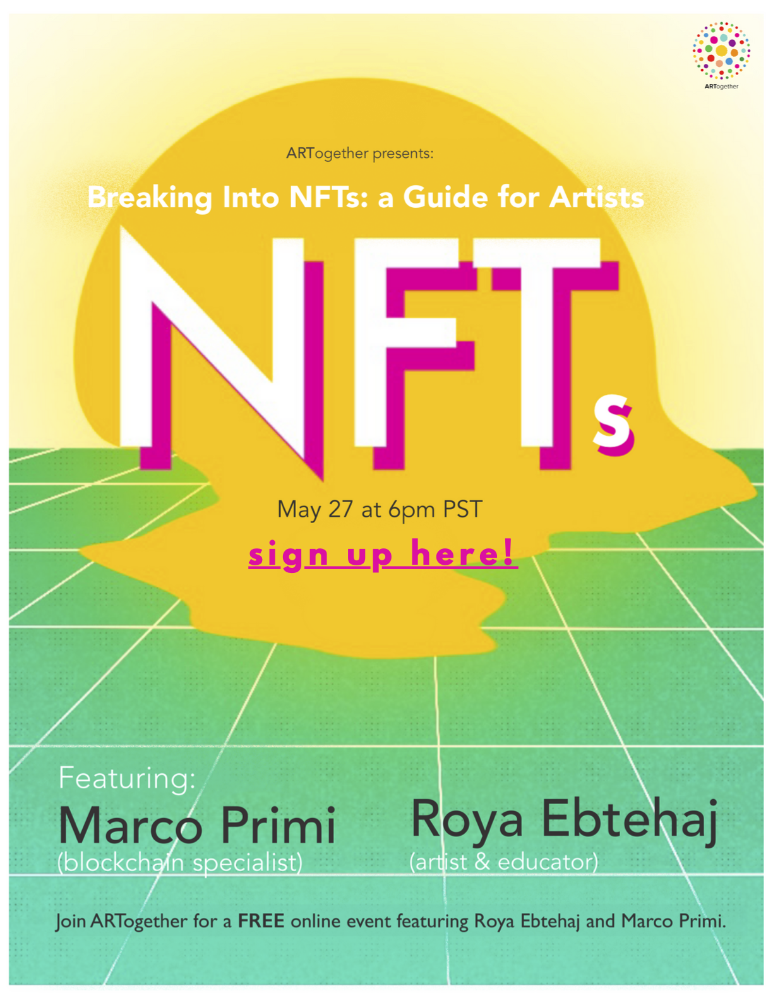
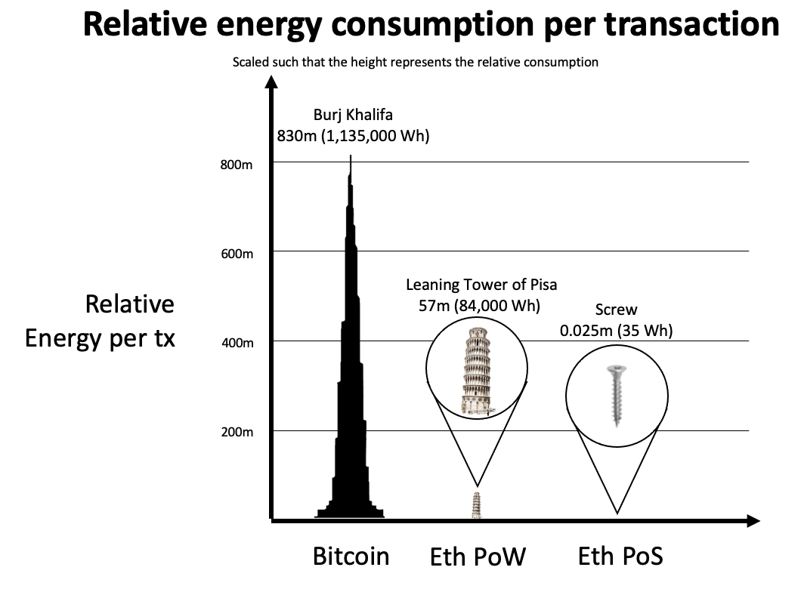
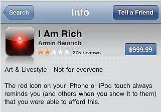

This presentation is [open source](https://github.com/mprimi/notes/tree/main/content/topics/breaking-into-nfts) ([CC BY-NC-SA 4.0](http://creativecommons.org/licenses/by-nc-sa/4.0))

---

# Breaking into NFTs: A Guide for Artists

---

# Hello World!

Thank you to the wonderful folks of [ARTogether](http://www.artogether.org/) for organizing this event.

---

# Blockchain

## What is it, and why should I care about it?

 - Blockchain vs. Bitcoin
 - Environmental impact

# NFTs
## Myths, misconceptions, some great practical uses

---

# `whoami`

Technology enthusiast, Distributed system engineer (I make lots of computers talk to each-other).

I have an affinity with blockchain due to academic research (10+ years ago).
**Consensus**, the math underlying blockchain technology.

I have no almost no interest in cryptocurrency or crypto art (commonly associated to NFTs).

Reducing blockchain to cryptocurrency is like reducing music to guitar playing.
The universe of music is bigger than guitars.
The universe of blockchain is bigger than cryptocurrencies.

---

Technology can be improve people's lives, or destroy them.
Often both at the same time.

The widespread adoption of the lightbulb made it easy to see in the dark.
But it also made it harder to see the stars.

Same goes for any other technology. Agriculture, the steam engine, antibiotics, radioactivity, the internet, smartphones, ...

Nothing is inherently "good" or "bad".

Same is true for blockchain.
Polarized opinions in favor and against it miss the larger picture.

---

# The State of Internet Services

Before jumping to the future, let's talk about the present.

Today, we rely on a number of internet service.

These companies are **trusted intermediaries**.

Amazon puts seller in contact with providers, and takes a fee on the sale.
Same for AirBnb and Uber.

Facebook, is doing the same, but for personal communication.

Your bank does the same every time you pay for a coffee.

Being a trusted intermediary very profitable.
And gives these companies a lot of power.

Especially in the US which relies heavily on the private sector.
Even for basic need such as healthcare.

---

# A Wild Blockchain Appears...

As individuals, our power is minuscule.

I'm excited about blockchain because I see it as the tool that shifts this (un)balance and obsolete the highly concentrated power structures.

It can help us connect directly to each-other. Without a company as intermediary.
And can help us be stronger together.

By creating public internet infrastructure and services not controlled by a company.
It can be used to create public internet infrastructure and services.
It can be used to create organizations that are open to anyone, transparent, resistant to takeover.

Blockchain has already been successfully used to:

 - Create banks and currencies outside the system
 - Enable secure direct exchange of services, material goods, information
 - Create social programs of (insurance, lending, benefits, ...)
 - Enable new kinds of democratic governments
 - ...

These are some of the more idealistic/optimistic possibilities.

Blockchain can be just as well for nefarious purposes:

 - Make the rich and powerful even more people rich and powerful
 - Surveil and control populations
 - Scam people, or enslave them through debt
 - Conduct illegal business (tax evasion, trade of illegal items, ...)

---

# [CuraDAO](https://curadao.io/)

Curaçao citizens re-bootstrapped their economy on the blockchain in 2020

 - Tiny island north of Venezuela, economy mostly based on tourism
 - Economy collapsed in 2020, skyrocketing inflation
 - Local economy rebuilt on blockchain
 - New local currency for locals
 - Transactions automatically taxed
 - Funds go into common pools spent for projects
 - Voting to allocate funds
 - No politicians!

Tiny economy, not gonna happen in the USA. But still an interesting case study.

---

# DAOs, Escrow contracts and shared treasury

How I stopped worrying and love working for strangers online

 - Clients deposit funds into escrow contracts on blockchain (no lawyers, no banks)
 - If they are happy about the work, they release the funds
 - Percentage put into a shared treasury
 - Guild members can vote to unlock funds

A simple example of how blockchain is making my own life better.
It allowed me to escape from the "big tech" world.

---

# Bitcoin vs Ethereum vs Blockchain

Bitcoin is a **single-purpose** blockchain.
It does exactly one thing: transfer Bitcoin from one wallet to another.
Includes incentives for people running the network ("mining") for the rest of us to use.

Ethereum is a **general purpose** blockchain.
It can be use to create all sorts of decentralized applications (dApps).

Currencies, voting systems, games, many kinds of NFTs, ...

Blockchain is a method of building decentralized applications.

It's a mechanism powerful enough that it can be used to create new currencies.

Creating new money was just the first killer app.

We are just getting started, and the possibilities are endless.

---

# Elephant #1: Blockchain is bad for the environment! 😡

**Bitcoin** (not blockchain) is responsible for a lot of CO2 emissions.

Started with good intentions: a currency free of government and banks control.

It became a victim of its own success. Its value skyrocketed.

End result: burn a lot of electricity to "print" money.

Highlights a problem we're currently facing: nobody is paying for the pollution we create.

 - Posting avocado toast pictures on Instagram emits CO2
 - Single-use food container (McDonalds, Starbucks, ...) we pay for production, but not for disposal. Mountains of un-recycled material a day.
 - Bitcoin shortens the loop: burns electricity to print money

All symptoms of the same problem: we are not paying for the consequences of our lifestyle.
We are passing the cost down to future generations.

I personally do not invest in Bitcoin (even if I believe it's a good investment) on ethical grounds.

We need to address this problem at the root, if we want to make a difference.

Bitcoin is just a symptom.

# Elephant #2: Blockchain is used by criminals! 🦹‍♂️

~Blockchain~ Bitcoin can be used to anonymously move money. True.

Some other things criminals use:

 * Cars
 * Hospitals
 * Phones
 * Electricity
 * Shoes
 * ...

Should we ban the use of these things because criminals use them?

Bitcoin creates the illusion of anonymity, staying actually anonymous pretty hard.
Creates an opportunity for law enforcements to make it *easier* to track criminals.

If I was a criminal, I would no doubt prefer cash over Bitcoin.

---

# Elephant #3: The blockchain is useless and stupid

Sometimes worded as: "you don't need blockchain to do that".

Same criticism faced by the iPhone in 2008: a pointless, expensive toy that is not even that good of a phone!

Fair criticism *at that specific point in time*.

But critics failed to foresee what would come next.

Similarly, criticism of the current state of the blockchain is sometimes fair.
But critics don't understand what doors this technology opens.

---

# NFTs

 > A 3-letter words known to cause FOMO and anxiety among artists.

---

# Fungibility and Uniqueness

The most common misconception stems from a misunderstanding of its definition:

 > A non-fungible token (NFT) is a unit of data stored on a digital ledger, called a blockchain, that certifies a digital asset to be unique and therefore not interchangeable

Fungible token: something symbolic that can be exchanged for an identical one.
Or broken up into fractions.
Example: a dollar.

What is not fungible is... non-fungible.

Uniqueness is not an all-or nothing concept. There are many shades.

Example: a high school issues hundreds of diplomas every year.
They are all identical, and yet they are all unique.

If we went with the **"there can be only one"** idea of uniqueness, we would need to burn down the school after the first student graduates.

This nuance is lost in the hyped up NFT world we live in today.

People take the naive interpretation of "unique" in a very absolute way.

---

# The NFT craze

NFT is synonym with "little bit of digital art sold for a ludicrous price"

Great example: "Nothing Fucking There" QR code in NYC.

Billboard probably cost a lot of money, but there's a good chance there will be at least one shmuck willing to pay a $1M for an empty NFT.

A better example, "Stay Free - Edward Snowden". Raised $5.5M for charity.

Selling a single unique NFT for your art is certainly an option.

But it's not the only option.

There's a lot more going on in the NFT world.

---

# Cryptoart

NFTs can be really interesting for digital artists.

Your art is infinitely replicable at no cost. Preventing copies is a fool's errand.

Instead, award "certificate of ownership" to buyers (emphasis on the plural) in the form of an NFT.

Interesting parallel with piracy boom of 2000.
Millions were spent to fight piracy.
As soon as legal and convenient ways to watch movies were available (e.g., Netflix, iTunes) piracy dropped significantly.

NFT could do the same for digital art.

Most people *want* to pay for what they take.

---

# NFT: Digital certificates

In general NFTs are micro-certificates anyone can create, send, receive.
It contains a little bit of data (text, or URL).

The sender pays the creation ("minting") and transfer ("transaction") cost.

Even better, they can be auto-minted when someone sends you money!
No need to set up a store!

Example: Android Jones just-take-my-money for my usage of your art in this presentation!

---

# Some examples

---

# NFT as token of appreciation

## Proof of thought/care ❤️

 - Christmas or birthday cards
 - Holiday postcards

More environmentally friendly than paper that need to be produced, moved, recycled.
They last forever and take no space

## Proof of presence 🙋‍♂️

 - Token of gratitude to event attendees (concerts, shows)
 - Memento of a museum, park, or landmark visit

Collectible, and carry bragging rights

---

# NFT as receipt

## Proof of donation

 - Receipt of donation to non-profit organization
 - Gratitude from an artist or activist you choose to support

Donor can proudly display them on their homepage/portfolio.

Example: WWF [Project Ark](https://project-ark.co/)

## Proof of purchase

 - Receipt for digital album purchase
 - Receipt for digital art purchase

Release an albums for free online, send an NFT to anyone that purchases legally.
Later, supporters could get priority access or discount to concert tickets.

---

# NFT as endorsement

## Proof of service provided or achievement

 - Employee/student of the month
 - Military service
 - Sport tournament medal

More secure and environmentally friendly.

## Endorsement

 - Thank your teacher, mentor
 - Wonderful person award

Can be used to build reputation that is otherwise hard to prove.
Can be used as future reference

---

# This is just the beginning

We barely scratched the surface of what is possible with blockchain and NFTs today.

Today is just the tip of the iceberg compared to what will be possible in a few years.

I am overall positive and very excited for what's to come.

---

# Communities

Recommended by friends involved in crypto art

## DADA

https://dada.art/

## Women of Crypto Art (WOCA)

https://womenofcrypto.art/

## Defiant Pixel Society

Ask me for an invite

## Clean NFTs

https://cleannfts.org/

---

A recording of this presentation is available online if you want to rewatch or share.

I love to give introductory tech talks to non-technical audience. Pro-bono.
(Blockchain, AI, Quantum computing, online security, and more)

Shoot me an email for questions/clarifications.

https://www.mpri.me
