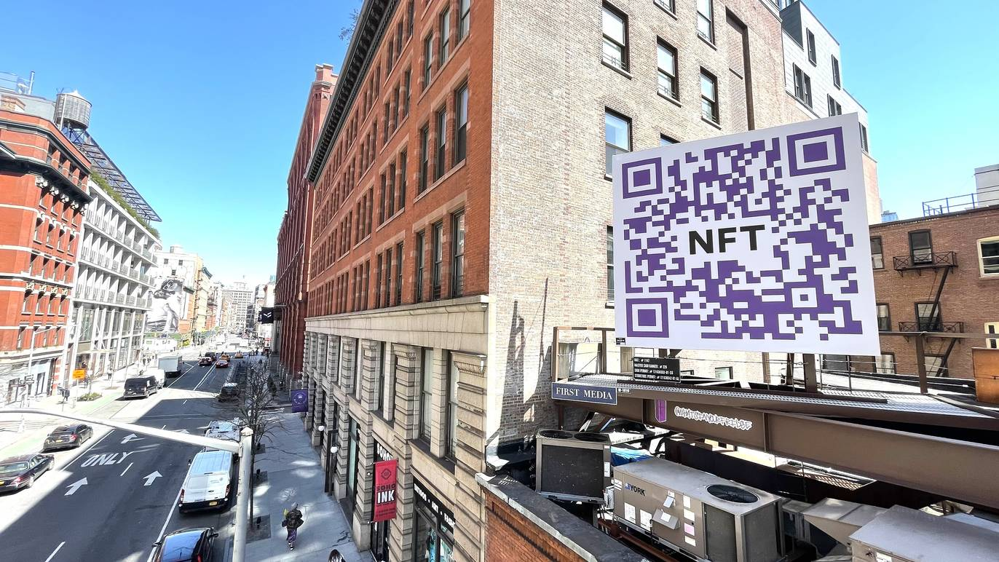
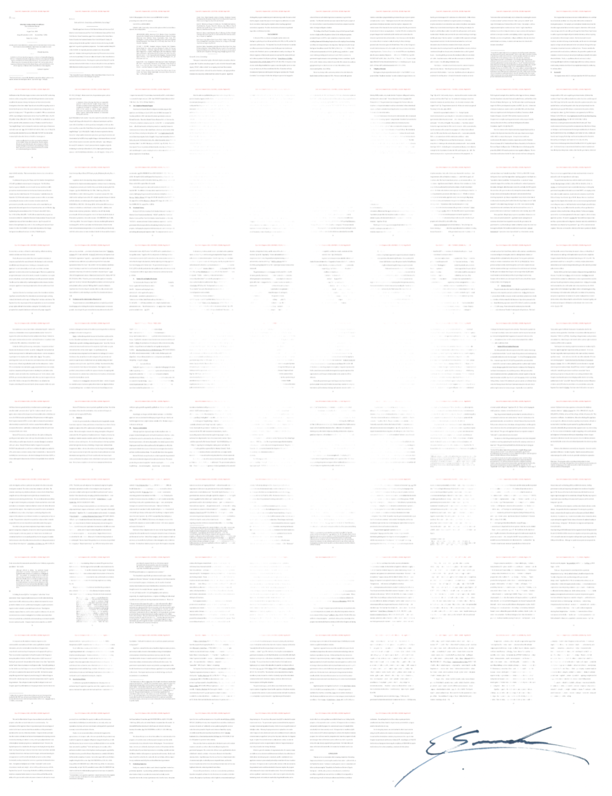

This presentation is [open source](https://github.com/mprimi/notes/tree/main/content/topics/breaking-into-nfts) ([CC BY-NC-SA 4.0](http://creativecommons.org/licenses/by-nc-sa/4.0))

---

# Breaking into NFTs: A Guide for Artists

---

# Hello World!

Thank you to the wonderful folks of [ARTogether](http://www.artogether.org/) for organizing this event.

---

> "The truest sign of intelligence is the ability to entertain two contradictory ideas simultaneously"

[Commonly attributed to author F. Scott Fitzgerald](https://quoteinvestigator.com/2020/01/05/intelligence/).

This presentation contains contradicting opinions.

Any technology can be improve people's lives, or destroy them. It often does both at the same time.

Example: the internet.
 - Puts the world knowledge at our disposal, we can learn any topic from anywhere, anytime.
 - It lets us connect with friends, family across the globe
 - It surveils us and pushes us to consume more, envy others
 - It can be hijacked to spread lies, propaganda, misinformation on a scale and speed unheard of until a few decades ago

Same goes for any other technology. Agriculture, the steam engine, antibiotics, radioactivity, ...

Nothing is inherently "good" or "bad".
Same goes for blockchain.

# `whoami`

Technology enthusiast, Distributed system engineer (I make lots of computers talk to each-other).

If you own an iPhone or Apple computer, you probably used *some* code I wrote.
Same if you ever watched Netflix.

I have a particular affinity with blockchain because around 15 years ago I was involved in academic research on **consensus** (the theory/math underlying blockchain).

I have no almost no interest in cryptocurrency or crypto art (commonly associated to NFTs).

It is mainstream perception that blockchain **is** cryptocurrency/NFT.

This is like saying "you are musician, therefore you play guitar".
Or "you're an artist, therefore you paint".

The universe of music is bigger than playing guitar.
The universe of art is bigger than painting.
The universe of blockchain is bigger than cryptocurrencies.

---

# Blockchain

## What is it, and why should I care about it?

 - Blockchain vs. Bitcoin
 - Environmental impact

# NFTs
## Myths, misconceptions

 - Well-known, questionable uses
 - Less known, great uses

---

# The State of Internet Services

Before jumping to the future, let's talk about the present.

Today, we rely on a number of internet service.

 * Facebook
 * AirBnb
 * Amazon
 * ...

They make our lives easier in a gazillion different ways.

<TODO graphic>

All these systems have one thing in common: they are **trusted intermediaries**.

Amazon is helping you find something you like, then mediating the transaction with the seller.
This is convenient and secure for you.
Same for AirBnb and Uber.

Facebook, is doing the same, but for personal communication.
It makes it easy, convenient, "secure" to talk to your friends.

On social networks, you are not directly talking to your friends anymore.
You talk to Facebook, and rely on them to pass the message along to your friends.

Developing and running these services costs millions of dollar a day.
Companies don't do this out of the kindness of their hearts!

Despite the massive costs, these companies make billions of dollars... How???

Being a trusted intermediary is incredibly profitable.
Social network can learn all your most private information.
They sell your data, your attention to the highest bidder.

 > "If it's free, you are probably the product"

Highly recommended: [The Social Dilemma (Netflix)](https://www.thesocialdilemma.com/)

---

# Beyond Internet Services

Social networks are just the most blatant example of this issue.

It's present in many other parts of our daily lives.

 - Banking, financial institutions
 - Insurance, healthcare
 - Government

As individuals, we have very little bargain power, and a minuscule hope to change the system.

---

# A Wild Blockchain Appears...

Blockchain can be the tool that shifts this (un)balance and obsolete the highly concentrated power structures.

It can be used to:
 - Create banks and currencies owned and controlled by people
 - Enable secure direct exchange of services, material goods, information
 - Create fair, decentralized, transparent social programs of (insurance, lending, benefits, ...)
 - Enable new kinds of democratic governments
 - ...

These are some of the more idealistic possibilities. Blockchain can be just as well for nefarious purposes:
 - Further concentrate wealth
 - Population surveillance and control
 - Scam people, or enslave them into debt
 - Conduct illegal business more securely (tax evasion, trade of illegal items)

---

# Some inspiring stories

## Escrow and treasury

How I stopped worrying and love working for strangers online

## Insurance

A group of individuals betting against mayhem

## CuraDAO

Curaçao citizens re-bootstrapped their economy on the blockchain in 2020 (think: government but without politicians)

---

# Bitcoin vs Ethereum vs Blockchain

Bitcoin is a single-purpose blockchain.
It does exactly one thing: transfer Bitcoin from one wallet to another.
Includes and incentive for people running the network ("mining").

Ethereum is a general purpose blockchain.
It can be use to create all sorts of decentralized applications (dApps).
Currencies, voting systems, games, ...

General-purpose blockchains such as Ethereum are **platforms**.
NFTs is one example.

Blockchain is a way of building decentralized applications that can be used by many people.

It's a mechanism powerful enough that it can be used to create new currencies.
We are just getting started, and the possibilities are endless.

---

# Elephant #1: Blockchain is bad for the environment! 😡

~Blockchain~ Bitcoin is a victim of it's own success.

Bitcoin started as idealized currency, free of government control.

Because people liked it, its value skyrocketed.

End result: burn a lot of electricity to print money out of thin air.

A great example of something wrong with the world today: nobody is paying the cost of polluting.

Other frivolous sources of pollution:

 - Posting avocado toast pictures, or looking at cat videos online
 - Single-use food containers
 - Stocking every supermarket in the world with beer
 - Sending Christmas cards
 - Sports events and tournaments, or video-games

Bitcoin is a blatant symptom/example of this problem.

Taking a heartburn pill is a more convenient "solution" to mitigate symptoms.
Addressing the actual problem involves more work (diet, exercise, ...).

(Coming up: some ways blockchain can actually be *good* for the environment)

# Elephant #2: Blockchain is used by criminals! 🦹‍♂️

~Blockchain~ Bitcoin can be used to anonymously move money. True.

Some other things criminals use:

 * Cars
 * Hospitals
 * Phones
 * Electricity
 * Shoes
 * ...

Should we ban the use of these things because criminals use them to conduct their shady businesses?

Bitcoin makes it easy to move *Bitcoin* anonymously. But it's actually **harder** for criminals to turn bitcoin into cash. Anyone can follow the money.

Bitcoin creates an opportunity for law enforcements to make it *easier* to track criminals because staying truly anonymous is harder than using cash.

---

# Elephant #3: The blockchain is useless and stupid

Sometimes worded as: "you don't need blockchain to do that".

Same criticism faced by the iPhone in 2008. A pointless, expensive toy that is not even that good at being a phone.

Critics were actually right *at that specific point in time*.
They failed to foresee what would come next.

We don't need AirBnb, we can rent houses and apartments with Craigslist!

We don't need Google maps, we can use paper maps, or put concierge booths on every street corner!

Criticism of the current state of the blockchain is sometimes fair.
But critics don't understand what doors this technology opens.

---

# NFTs

 > A 3-letter words known to cause FOMO and anxiety among artists.

Concept often conflated and confused with crypto art (a.k.a. blockchain graffiti).

---

# Uniqueness

The most common misconception stems from a misunderstanding of its definition:

 > A non-fungible token (NFT) is a unit of data stored on a digital ledger, called a blockchain, that certifies a digital asset to be unique and therefore not interchangeable

Most common interpretation: **there can be only one**.

Fungible token: can be exchanged for an identical one.
Example: a dollar, a laundry machine token is fungible.
It may also make sense to exchange a fraction of it (i.e. half a dollar).

Everything else is non-fungible.
Example: the teddy bear you had as a kid. There are thousands just like it. But you don't value any other one the way you value yours. Yours is **special to you**.
Both unique and not unique.

Example: your high school graduation diploma. Thousands are issued every year.
The equivalent of build a school, graduate a single student, issue one diploma, then burn down the school. 🤦‍♂️ Yet, the one with your name on it is unique and valuable to you.

This nuance is lost in the hyped up NFT world we live in today.
People take the naive interpretation of "unique" in a very absolute way.

---

# The NFT craze

NFT is synonym with "little bit of digital art sold for a ludicrous price"

There's more to the NFT world, but you hardly hear about it from mainstream sources.

My suggestion: ignore the noise, keep doing what you love doing.

The only form of art behind these sales is the art of duping rich shmucks by creating artificial scarcity.

There's a lot more going on in the NFT world unrelated to this nonsense.
---

# Cryptoart

On the other side, digital art is infinitely replicable at no cost.
Anybody can take credit for it.

It would be nice for the artist to award "ownership" to buyers.

Edward Snowden recently auctioned an NFT for 'Stay Free' (court decision ruling the National Security Agency's mass surveillance violated the law), sold for 5.5 millions, donated to the Freedom of the Press Foundation.

This art is public domain, but one person purchased the bragging right.

The transaction is forever preserved on the blockchain, anyone can verify it.

Owner may decide to re-sell anonymously, or reveal their identity. Or not.

---

# NFT: Digital certificates

In general NFTs are micro-certificates anyone can create, send, receive.
It contains a little bit of data (often used to point to an image).

The sender pays the creation ("minting") and transfer ("transaction") cost.

They contain a digital signature of the issuer, so can be verified by anyone, and cannot be forged or stolen.

Example: if you have a wallet, I will send you an NFT for attending this seminar, as a thank you.

Ignoring FOMO art sales, NFTs are pretty cool.

---

# NFT as token of appreciation

## Christmas or birthday cards

More environmentally friendly than paper cards.

They don't get tossed, they last forever without taking space.

## Proof of presence

A token of gratitude to send everyone that attended a concert or performance.
Fans could collect them, show them off for bragging rights.

Same for museums, theaters , shows, etc.

---

# NFT as receipt

## Proof of donation

Non-profit organizations could send an NFT as 'receipt' for a donation.

Donor can proudly display them on their homepage/portfolio.

Leverage "collectable" mechanic to incentivize recurring donations.

WWF [Project Ark](https://project-ark.co/)

## Proof of purchase

Musicians releasing their albums for free online, but sending an NFT to anyone that purchases.
Fans can get priority access to tickets.

Same for digital art, and anything else that can be duplicated at zero cost.

---

# NFT as endorsement

## Proof of service provided

Instead of a commemorative plaque, after 5 years at a given company.

More secure and environmentally friendly.

## Endorsement

If someone was a mentor, or helped you, or was by your side.

You can immortalize your gratitude in a token. They can use it for future reference to prove their reputation.

---

# This is just the beginning

We just scratched the surface of what is possible with blockchckain and NFTs today.

And today is just the tip of the iceberg compared to what will be possible in a few years.

I am overall positive and very excited for what's to come.

---

# Communities

## DADA

https://dada.art/

## Women of Crypto Art (WOCA)

https://womenofcrypto.art/

## Defiant Pixel Society

Ask me for an invite

## Clean NFTs

https://cleannfts.org/

---

A recording of this presentation is available online if you want to rewatch or share.

I love to give introductory tech talks to non-technical audience. Pro-bono.

Blockchain, AI, Quantum computing, online security, and more.

https://www.mpri.me

---
