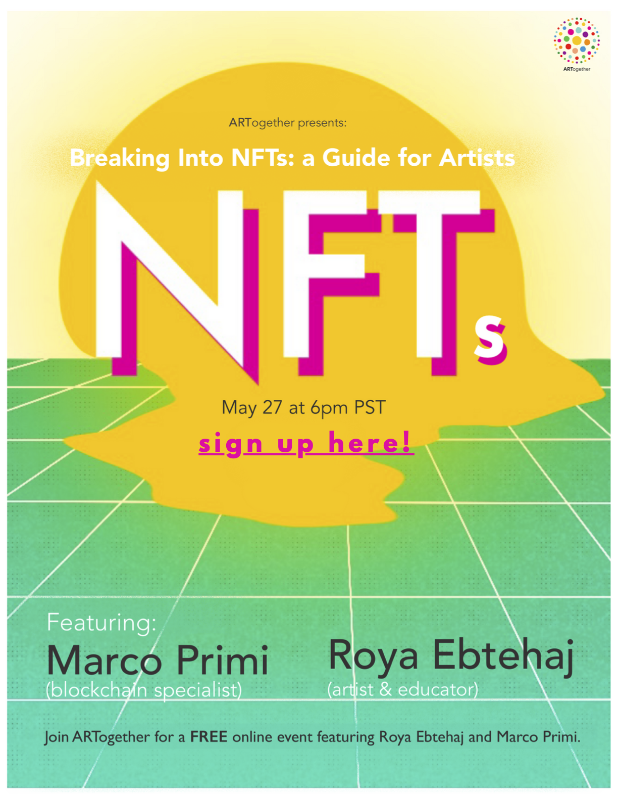
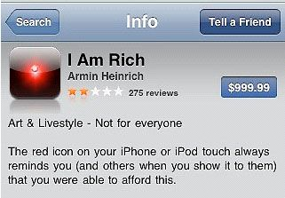

This presentation is [open source](https://github.com/mprimi/notes/tree/main/content/topics/breaking-into-nfts) ([CC BY-NC-SA 4.0](http://creativecommons.org/licenses/by-nc-sa/4.0))

---

# Breaking into NFTs: A Guide for Artists

[Video](https://youtu.be/BhKzb_VJ958) (pre-recorder/rehearsal with additional content)

---

# Hello World!

Thank you to the wonderful folks of [ARTogether](http://www.artogether.org/) for organizing this event.

---

# `whoami`

Technology enthusiast, Distributed system engineer (I make lots of computers talk to each-other).

I have an affinity with blockchain due to academic research (10+ years ago).
**Consensus**, the math underlying blockchain technology.

I have little interest in *cryptocurrencies* and NFTs.

Reducing blockchain to cryptocurrency is like reducing music to guitar playing.
The universe of music is bigger than guitars.
The universe of blockchain is bigger than cryptocurrencies.

---

# Technology

Technology can improve people's lives, or worsen it them.
Often it does both at the same time.

The widespread adoption of the lightbulb made it easy to see in the dark.
But it also made it harder to see the stars.

Same goes for any other technology.
Agriculture, the steam engine, antibiotics, radioactivity, the internet, smartphones, ...

Nothing is inherently "good" or "bad".

Same is true for blockchain.
Polarized opinions pro/against blockchain miss the larger picture.

---

# Trusted Intermediaries

Before jumping to the future, let's talk about the present.

Today, we depend on a number of service and companies to do anything.

To buy toilet paper, use Amazon which puts you in contact with a seller.
This is convenient and secure.

To talk to your friends, talk to Facebook, they will relay they message for you.

For better or worse, this is the state of things.

These companies have a huge amount of power over us.

---

# A Wild Blockchain Appears...

I'm excited about blockchain because I imagine uses that shift this power un-balance.

It can help us connect **more directly** to each-other, without a company as intermediary.

The most famous example is Bitcoin.
A currency that exists outside of the system and outside of the control of governments and banks.

I am optimistic, but also scared.
Blockchain can be used for things I don't like:

 - Increase wealth and power inequality
 - Surveillance and control
 - Illegal business (scams, tax evasion, trade of illegal items, ...)

---

# [CuraDAO](https://curadao.io/)

Illustrates the potential of blockchain, when put to good use.

Curaçao citizens re-bootstrapped their economy on the blockchain in 2020

 - Tiny island. Economy mostly based on tourism
 - Economy collapsed in 2020, skyrocketing inflation
 - Local economy rebuilt on blockchain.
 - New local currency for locals
 - Transactions automatically taxed
 - Funds go into common pools spent for projects
 - Voting to allocate funds
 - No politicians!

Tiny economy, not gonna happen in the USA. But still an interesting case study.

---

# DAOs, Escrow contracts and shared treasury

On a personal note, I do use blockchain to work with and for strangers on the internet.

 - Escrow contracts make sure I get paid
 - Shared treasury for common needs and projects, spent through voting

---

# Bitcoin vs Ethereum vs Blockchain

Bitcoin is a **single-purpose** blockchain.
It does exactly one thing: transfer Bitcoin from one wallet to another.
Nobody controls the network, everyone can participate. Everything is open-source.

Ethereum is a **general purpose** blockchain.
It can be use to create all sorts of decentralized applications (dApps).
Currencies, voting systems, games, many kinds of NFTs, ...

Blockchain is a method of building decentralized applications.
Dozens of variants exists. With different tradeoffs and advantages.

---

# Elephant in the room: Blockchain is bad for the environment! 😡

It is true that **Bitcoin** (not blockchain) is responsible for a lot of CO2 emissions.

I like bitcoin but choose not to invest in it, because I don't want to feed the beast.

This shines the light on a larger problem in our society: we are not paying the true cost of the pollution we create.

Every cup of coffee we buy, use, and throw away, generates waste.
Nobody is paying for the true cost of disposal.

The same is true for everything else we do.

Bitcoin just makes it very easy to calculate this cost because it's a simple transformation from electricity and (CO2) to money.

Similar amounts of electricity are wasted posting avocado toast pictures on instagram.
But that's a lot harder to calculate.
And so harder to point the finger to it.

We need to address this problem at the root, if we want to make a difference.

Bitcoin is just a symptom.

Later on: ways blockchain can be **good** for the environment.

---

# NFTs

 > A 3-letter words known to cause FOMO and anxiety among artists.

---

# The NFT craze

Nowadays, NFT is synonym with "little bit of digital art sold for a ludicrous price"

Great example: "Nothing Fucking There" QR code in NYC.

Business model works like this: create something unique and tell as many people as you can.
If even one or two people fall for it, you're rich.

A billboard in NYC is very expensive. They only need 1 shmuck to make it worth it.

Reminds me of the "I am rich!" iPhone app

---

# Uniqueness

Auctioning one-of-a-kind NFT is an option.

"Stay Free - Edward Snowden". Raised $5.5M for charity.

Public domain art, one person owns "bragging rights".

Each NFT is inherently unique, even if you produce 1000 identical ones.

Just like each diploma awarded by a university is unique.
We don't need to burn a school down after awarding a single diploma.

---

# Cryptoart

NFTs can be really interesting for digital artists.

Interesting parallel with piracy boom of late 90s.
Billions were wasted fighting piracy, nothing really worked.

Legal and convenient ways to watch movies became available (e.g., Netflix, iTunes).
Soon after, piracy dropped significantly.

NFT could do the same for digital art.

Most people *want* to pay for what they take.

Your art is infinitely replicable at no cost. Preventing copies is a fool's errand.

I would have paid for all the art I "stole" for this presentation.

---

# NFT: Digital certificates

Think of NFTs as micro-certificates that anyone can create, send, receive.

They can be auto-minted when someone sends you money!

You don't need to set up a store.

---

# Some examples

---

# NFT as token of appreciation

## Proof of thought/care ❤️

 - Christmas or birthday cards
 - Holiday postcards

More environmentally friendly than paper that need to be produced, moved, recycled.
They last forever and take no space

## Proof of presence 🙋‍♂️

 - Token of gratitude to event attendees (concerts, shows)
 - Memento of a museum, park, or landmark visit

Collectible, and carry bragging rights

---

# NFT as receipt

## Proof of donation

 - Receipt of donation to non-profit organization
 - Gratitude from an artist or activist you choose to support

Donor can proudly display them on their homepage/portfolio.

Example: WWF [Project Ark](https://project-ark.co/)

## Proof of purchase

 - Receipt for digital album purchase
 - Receipt for digital art purchase

Release an albums for free online, send an NFT to anyone that purchases legally.
Later, supporters could get priority access or discount to concert tickets.

---

# NFT as endorsement

## Proof of service provided or achievement

 - Employee/student of the month
 - Military service
 - Sport tournament medal

More secure and environmentally friendly.

## Endorsement

 - Thank your teacher, mentor
 - Wonderful person award

Can be used to build reputation that is otherwise hard to prove.
Can be used as future reference

---

# This is just the beginning

We barely scratched the surface of what is possible with blockchain and NFTs today.

Today is just the tip of the iceberg compared to what will be possible in a few years.

I am overall positive and very excited for what's to come (and scared of the unintended consequences).

---

# One more thing

Crypto art **communities** recommended by friends.

## DADA

https://dada.art/

## Women of Crypto Art (WOCA)

https://womenofcrypto.art/

## Defiant Pixel Society

Ask me for an invite

## Clean NFTs

https://cleannfts.org/

---

A recording of this presentation is available online if you want to rewatch.
If you liked it, please share it with your friends!

I love to give introductory tech talks to non-technical audience. Pro-bono.
(Blockchain, AI, Quantum computing, online security, and more)

Shoot me an email for questions/clarifications.

https://www.mpri.me
