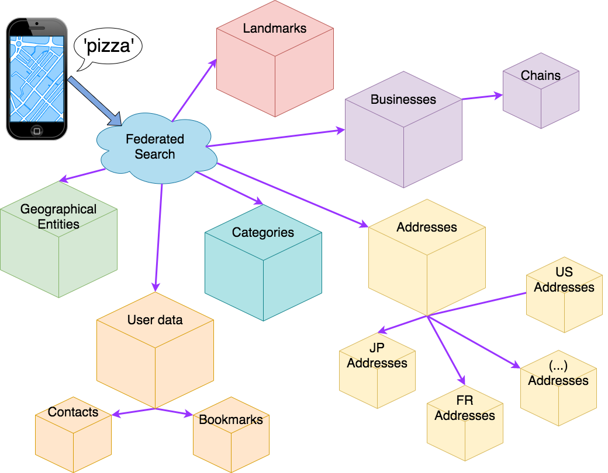
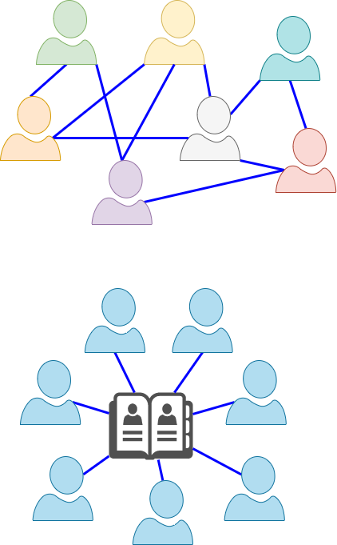
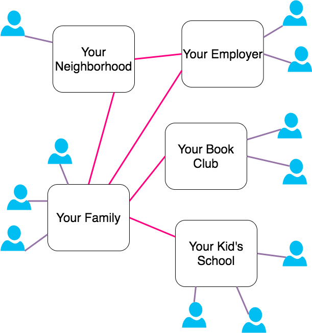

### The recurring theme of federation in distributed system

Some editorial choices about this deck:

* Entertaining > Precise
* Cool > Useful
* Future > Present

*(Presenter notes available in the source of these slides)*

<!--
* Federation in distributed systems
* A collection of examples across various domains and abstraction levels
-->

---

## IRL Federation

* [United Federation of Planets](https://en.wikipedia.org/wiki/United_Federation_of_Planets) 🖖
* [United States](https://en.wikipedia.org/wiki/Federalism_in_the_United_States) 🇺🇸
* Most companies (teams, franchises, branches) 🏭

**Federation**: organization pattern involving a combination of centralized decision-making and as peripheral autonomy

Hybrid of top-down (hierarchical) and peer-to-peer (decentralized)

<!--
* Federation broad concept that exists in different domains
* Sci-fi: Federation of Planets (Star Trek)
* Real world: Federal government of the US
* A large company (say, Google) could be described as multi-level federation of teams.
* Definition: pattern of organization that involves both centralized decision and peripheral autonomy
* Anecdote: Federalism was the hot topic in 80/90s in Italy
    * Idea: give more control to Italy’s region, rather than collect all money in Rome then redistribute it to-down
    * Even if everyone can agree on federation, it’s a long way to agree to details
-->

---

## Federation in Computer Systems

The abstract pattern of Federation is everywhere.

Often in disguise, or called with by different (more precise) names

* DNS
* E-Mail
* Kernel
* CPU architecture

<!--
* Narrow down the scope to computers
* Federation is everywhere
* One example: DNS, hierarchical, top-down resolution.
    * But federated: authoritative DNS are managed independently
    * Authoritative DNS come and go, independently of top-level
* Handwavy example, don’t quote me on this one
    * The way Operating System interacts with CPU and schedules on various core
    * Could be seen as federating chunks of work
    * CPU can has some degree of autonomy on caches, pipelining, branching
* Federation is pervasive in computer systems
-->

---

## Federation in Distributed Systems

Concept of federation is broad overlaps with many concepts we encounter everyday:

* Gateway, Router, Facade patterns
* Orchestration pattern
* Microservices & decentralized systems

Federation is abstract and overlaps with these and more.

In the rest of this deck: practical examples of federation in action

<!--
* Let’s narrow down further to federation in distributed systems
* Federation is everywhere
* But not usually called out explicitly
* Usually because more precise terms exists, sub-types of federation
* Being a broad term it can be confusing
* Example: single endpoint that hides and routes to different services
    * Call it Gateway, or router
* OR service that encapsulates multiple services
    * Making sub-requests, coordinating, assembling the response
    * You would probably describe this as Orchestration or Facade
* In micro services architecture these patterns are everywhere
* Federation term overlaps with these and more concept
* Only if we zoom out and ignore the details, we can see how federation is prevalent
* This is what the rest of this presentation will do:
    * Jump from system to system keep an eye out for federation patterns
 -->

---

## Data federation
### [GraphQL](https://graphql.org/) & [Apollo](https://www.apollographql.com/)

> "GraphQL is a query language for APIs and a runtime for fulfilling those queries with your existing data"

Below the API, query federation.

Apollo stores no data, it federates the request to other systems.

Data layout, location, provider can change without affecting users.

<!--
* Simple example of federation used to query data
* GraphQL is all the rage today
* The idea: decouple data as seen by users from data as stored or materialized
* GraphQL is a language to define an API for data
* Apollo is a popular implementation
    * Backend is ready to be connected to various datasources
    * DB, APIs, services, ...
* When a user asks for data, Apollo takes care of the details
* At high level, this is an example of data federation
 -->

---

## Search federation
### Maps Search

Different queries require very different handling, separate indices, ranking, spell-correction model, and more.

* "Starbucks"
  * Nearby locations of a specific chain
  * Or maybe coffee shops
* "1200 Main Street"
  * An address (that exists in hundreds of towns!)
  * Show the closest?
* "1600 Pennsylvania Ave"
  * A nearby address?
  * Or a very famous landmark? (the White House)
* "Paris"
  * Paris, France?
  * Paris, Texas?
  * (many other)

<!--
Search is hard: divide and conquer!

* Service federation
* Break down a complex problem into more manageable parts
* Maps Search
* Open Google Maps and search for “starbucks”
    * Starbucks location near you.
    * What is happening in the backend?
    * Probably, the engine has index of business names and their location, category, and many other details
    * Query includes user location, viewport and more contextual metadata that can help narrow down the most salient locations
* Now search for an address
    * Same address may exists in hundreds of towns
    * Indexing and ranking of addresses is quite different from businesses
    * Furthermore addresses are very different in different parts of the world
* What if I search for a city
    * Paris takes me to France, not to Texas
    * Again, different indexing and ranking
* Same for landmarks, categories, etc
* What I meant to say here is... it gets complicated very quick
* When things get complicated, divide and conquer!
    * Federation to the rescue
 -->

---

## Search federation
### Maps Search Architecture

A collection of small specialized search engines.

 - Category search
 - Address search
 - Contacts search
 - Businesses search
 - Landmark search
 - Geographical entities search
 - ...

And auxiliary services

 - Spelling suggestions
 - User metadata and history
 - Driving time estimation
 - ...

<!--
* Here’s how a maps search engine may look
* Top-level facade, and it may make use of components I left out (eg. Spelling corrections)
* Delegates search to specialized search engines
* Example: pizza
  * Landmark search and address search may say: I got nothing
  * Business search may return some result with pizza in the name
  * Category search would say “pretty sure this is a category search”
  * Re-issue targeted business search with category “pizza restaurant”
* As far as I know, all major search engines are federated this way
  * In reality, a lot more complicated, for example due to language and other conventions that change over the world
-->

---

## Federated storage
### [FileCoin](https://filecoin.io/)

Planetary scale decentralized file storage system.
Utilizes the blockchain to track blocks and reward people for storing them.

Mine (get paid) to offer storage capacity
Pay others to store, serve, replicate, ...

Similar: [Threefold](https://threefold.io/) (P2P compute grid), [LivePeer](https://livepeer.org/) (video encoding grid), and many more

<!--
* Filecoin: Blockchain based global storage network
  * Not a P2P file-sharing (although it is P2P), more similar to S3 than to Napster
  * Not a cryptocurrency (although it does use its own currency)
* Decentralized planet-wide storage system, anyone can participate in
  * Say you have a few spare hard disk at home
  * Set up a node and ‘rent’ your storage
  * To mine Bitcoin you burn burning CPU, to mine Filecoin store chunks of data
  * Data is encrypted
  * A little more complicated than this: different kinds of nodes getting paid to do different things (store, cache, manage)
  * Currently 1 hexabyte capacity
* P2P federation file coin is just a protocol
  * Nodes are independently operated
  * Pricing scheme, strategy, etc
* Protocol Labs (company) is not an intermediary
* Decentralized networks with fractionalized economies are gaining steam
    * Threefold is similar but for compute (think: SETI or Folding @ Home)
    * More specialized: LivePeer for video encoding
    * And many, many more on the horizon
-->

---

## Federated infrastructure
### [GAIA-X](https://www.data-infrastructure.eu/GAIAX/)

European Union next generation cloud.

Similar to AWS in that it offers a variety of services, from bare metal machines, all the way up to high level services.

AWS is centralized, GAIA-X is federated through and through.
Only offers the basic protocol for providers and consumers to find each-other and negotiate terms.

* Federated resource catalogs: compute, storage, bandwidth, ...
* Federated services catalog: high level functions, services and API, ...
* Federated data catalogs, with varying degree of access, licensing, ...
* Federated identity and trust: to regulate and delegate access to data and resources

<!--
* An ambitious EU project for next generation cloud
* One way to describe it: AWS but decentralized and federated
* Instead of a single provider of compute, storage, bandwidth anyone can offer their resources
  * Add resources to a catalog
  * Advertise resources specification as well as costs, SLAs, and more
* Applications can use a standard query language to locate and reserve resources, acquire them, release them after use
  * Example: I need 20 hosts with at least 4 CPU, 4GB of memory, 500GB hard-disk. 5 of them need to be located in italy, 10 of them need to be in France, the remaining 5 anywhere inside the EU.
* Similarly, catalogs exist for services and APIs
  * Example: translate this text to language X, Y, Z.
  * Rate limits, number of requests, cost, etc can be negotiated programmatically
* Data catalogs
  * Example: Average household income for asian countries between 2001 and 2011
  * License, usage rights, price are part of the agreement
* In this kind of system, trust is a basic need. Identity and trust are built into the protocol.
  * Naturally, different identity and trust mechanisms can be built-in
* The website has many very cool case studies
-->

---

## GAIA-X Use case example
### [Medical records](https://www.data-infrastructure.eu/GAIAX/Redaktion/EN/Artikel/UseCases/framework-of-medical-records-in-europe.html)

Each citizen has a virtual medical record.

It is stored safely in the cloud.

 * The patient can grant access to a new doctor
 * The doctor can add to the medical record (and retain access to the newly added data)
 * the patient can delegate access to a parent or guardian
 * Research institution may have limited access to aggregate data for statistics and research purposes
 * Insurance, prospect employer, etc may request partial access

---

## Federated Service Platforms

Uber, AirBnb & co successfully connect demand and supply at scale.

But their primary driver is profit. Above all they need to appease shareholders and investors.

Making users happy is just a secondary goal. A mean to an end.
The real goal is: make money.

Re-imagine these platforms without the shareholders (or making users the shareholders).
Same service, different goal: optimize for the collective good of all users.

More similar to public utilities than to for-profit companies.

Built on open-source (trust is paramount).

Still collect a fee on transactions, but use it to:

 * Pay for infrastructure costs, insurance
 * Compensate employees (support, developers, legal, ...)
 * Reinvest surplus into making the platform better or give fractional dividends to all participants

Examples: [Eva](https://www.eva.coop/), [FairBnb](https://fairbnb.coop/), [WindingTree](https://windingtree.com/)

<!--
* Marketplace platforms changed our lives in the last 10-15 years
* Companies like Uber and AirBnB have seen incredible success in connecting demand and supply on large scale
* Companies are first and foremost for-profit ventures
* Successful ones manage to balance goals of making money, providing a service, giving people a way to make money
* 3 goals are not always aligned
    * Example: security of riders of ride-sharing app, it’s expensive to do it very well!
    * Example: protections for drivers, also expensive.
* A new trend is emerging, federated platforms
    * Consumers and providers become the shareholders
    * Infrastructure provided for safe negotiation, contact, reputation
    * More similar to open-source utilities than today’s startups
    * Eva is Uber, FairBnB is AirBnB
    * These are just 1:1 conversions, But there’s many more innovative ideas being built
 -->

---

## Federated Social Networks

Facebook, Reddit, Twitter, Instagram, etc.
Are great for staying in touch with friends, discuss current events, and more.

But satisfying user's need for connection is just a mean to an end.

The goal of these platform is to make money to shareholders.
They are not shy of using dirty tricks to get users to:
 * Reveal private information, which they can harvest and monetize
 * Get people addicted, enraged, misinformed, anything required to keep them engaged

User's interests (such as privacy) are only considered if ignoring them is damaging to the platform.

A new generation of federated social platform are emerging: [Diaspora](https://diaspora.social/), [Mastodon](https://joinmastodon.org/), [Mobilizon](https://mobilizon.org/en/), and more.

<!-- * Social Networks, great tools to keep us connected
* They are wolf in sheep clothes
* Companies make money by mining our data, selling our attention
* Make money by keeping us engaged, to an unhealthy degree.
    * Use dirty tricks to keep our attention: misinformation or inflammatory content
    * These keep us scrolling
* Top diagram - what we want
* Bottom - what we actually have
* Can we do better?
* Definitely yes! Keep the good parts: social connections, exchange of ideas
* Dump the bad: monetary exploitation
* In this space, there are some cool projects gaining steam
* Mastodon: federated twitter
* Diaspora: federated Facebook
* Mobilizon: federated Facebook events
* Set up a diaspora node for you and your friends
    * Pretty cheap
    * Full control on how connected you want to be to the rest of the ecosystem
* Example, if you have kids
    * Safe platform for them to stay in touch with their friends
    * Protected and segregate them from the rest of the internet
    * Same goes with your family, neighborhood, your book club
 -->

---

## Federated Communications
### [Matrix](https://www.matrix.org/)

WhatsApp, Telegram, Discord, iMessage, GMail, ... provide a great service, but at a (hidden) cost.
Your data is being mined and sold (end-to-end encryption is a marketing ploy).

Matrix is a federated, decentralized answer to this problem.
An open-source protocol for instant messaging (and, communications in general).

Built ground-up to be federated.
Small groups of people can operate their own homeserver, sharing the cost.

Through the homeserver, they can connect to the rest of the world (or not).

<!--
* Matrix is the cool new protocol in town
* Federated network of independently run servers
* Each user has a home-server (run by a trusted person)
* Can talk to anyone else in the federation, or keep isolated
* E2E encrypted
* Specification is open source, various implementations available
-->

---

Further reading:

 * [Beyond distributed and decentralized: what is a federated network?](https://networkcultures.org/unlikeus/resources/articles/what-is-a-federated-network/)
 * [The Ultimate Guide to Federated Architecture & Decentralized Social Networks](https://www.8bitmen.com/the-ultimate-guide-to-federated-architecture-decentralized-social-networks/)
 * [Decentralized Social Ecosystem Review](https://ipfs.io/ipfs/QmdFrru4PyHzXGZztEPnYToBR3QovD7fkC1HSyty22LzfD)

---
